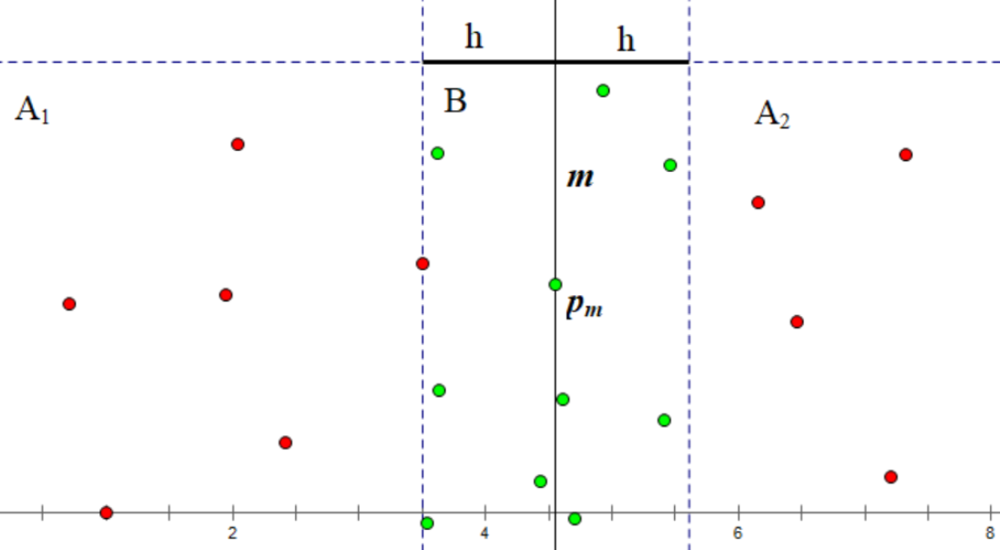

# Plane Nearest Point Pair

It's a popular problem to solve: given $n$ points on a plane, how to find the minimum distance between two points?

If you are familiar with Delaunay triangulation, then you can simply calculate the Delaunay triangulation first and then iterate over every edges (the total number of edges in Delaunay Tri. is linear to the number of points).

A classical and straightforward algorithm is **divide and conquer**.

We first sort all points by x-coordinate. Then we divide all points into two even halves $S_1, S_2$ and call the recursive procedure.

Suppose we already get the min distance $h_1, h_2$ for $S_1, S_2$. Let $h = \min(h_1, h_2)$. Then clearly now we only need to consider distance between a point in $S_1$ and a point in $S_2$, and both of them lie in a stripe of width $h$ from the pivot element.

Suppose we have some magics to sort the green points in y-coordinate within linear time, then we can simply use a sliding window to tract for each point in green set, which points can be candidate of nearest pair.

Another concern would be: what if the size of sliding windows is too large? 

That's indeed not the problem because we can prove that there will be at most 6 points in the sliding windows otherwise the min dist in $S_1, S_2$ wouldn't be $h$.

Then how can we sort the points in y-coordinate?

Easy, we can let the recursive procedure to simply return a y-axis sorted array and for each pass we do a merge them together.

## Randomized Algorithm

There is also an interesting interative algorithm works in expected $O(n)$ time with randomization.

Suppose we already know the min dist for first $i$ points is $h$. Then we divide the whole plane into meshes of size $h$, and for each point we determine which grid it's in and store this information with a hashmap. Each time a point $v$ comes, we find the resident grid of $v$ and all candidates for new min dist must live in the surrounding grids. If no new min dist appear, then nothing happens, the algo goes on; if new min dist found, then we divide the plane into new meshes of size updated min dist $h'$.

For $i$ points, the probability that min dist involves $i$-th point is $O(\frac{1}{i})$, while the time cost to re-construct the new meshes is $O(i)$, so the expected time cost for each iteration is $O(1)$, which sum up to $O(n)$.