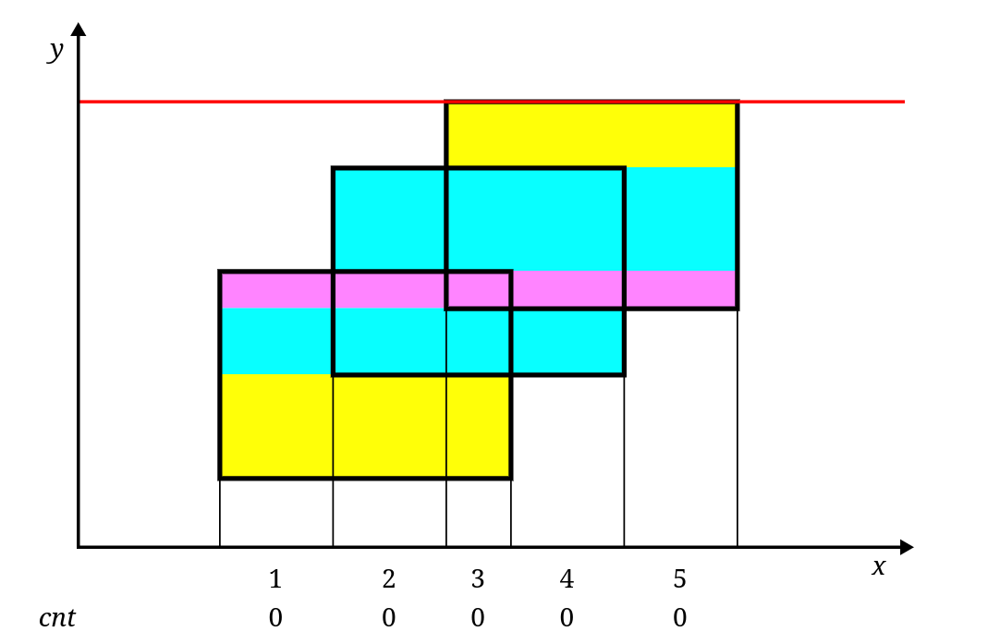

# Scanning Line

Scanning line is an algorithm that can be used to solve problems like: calc the area of several probably overlapping rectangles.

Here is a perfect illustration:

As the figure shows, we divide the area into several sub-rectangles by imagining a scanning line moving from bottom to top.

Clearly, we need to manintain at each time point, how **wide** can the rectangle be. This can be done with a value segment tree.

What interface should the value segment tree provide?

1. Range +1/-1
2. Calculate number of all non-zero position.

Since we don't need general range query, we don't have to maintain tag pushdown. Also, since we always do a $+1$ to an interval before we do the $-1$, so we don't need to worry that the tag would be decreased to negative numbers.

In this case, segment tree is more like a data structure that divide the entire intervals into several sub-intervals and use a node to represent each interval: $[0, n], [0, n/2], [n/2, n], [0, n/4], \cdots $.

Even though we have lots of sub-intervals, there are only linear number in total.

The wonderful properpy is that for any interval $[l, r]$, we can divide it into no more than $O(\log (r - l))$ sub-intervals or i.e. nodes in segment tree.  

In fact, similarly we can also divide the range $[0, n]$ into $\sqrt{n}$ sub-intervals. The idea is basically the same. s