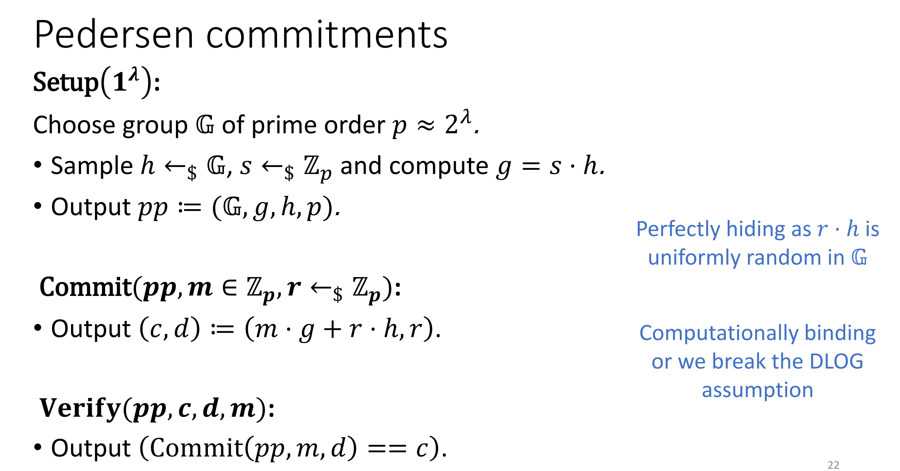
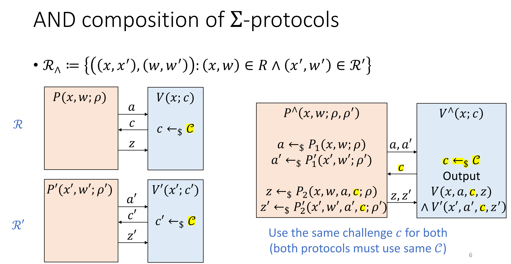
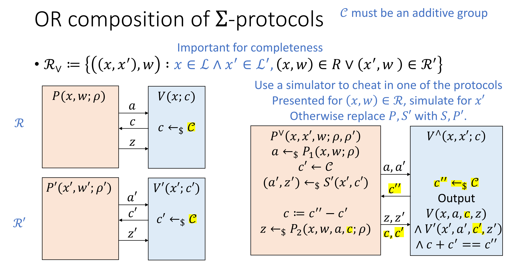
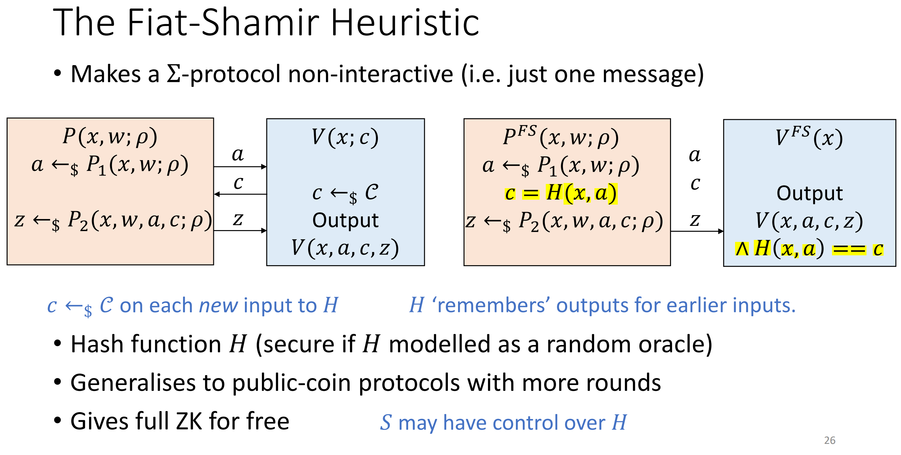
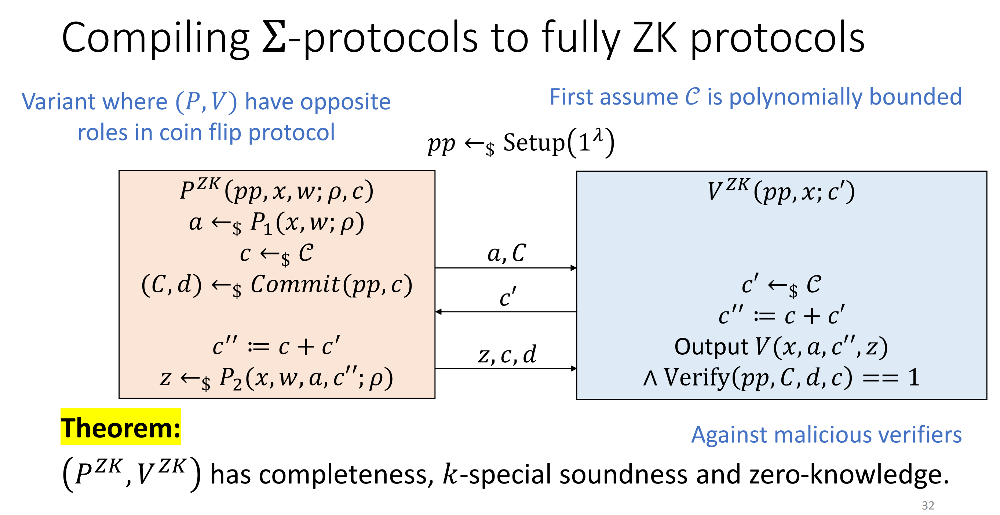
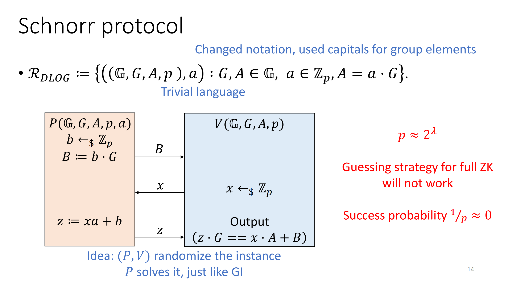
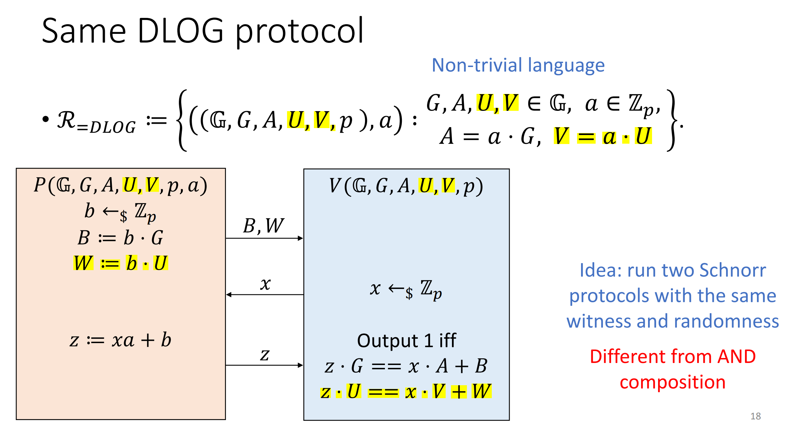
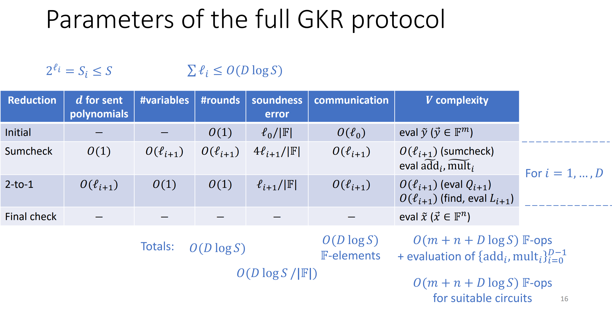

感觉 ZKP 实在是很难用英文写笔记，太累了。。脑子跟不上，还是中文吧。

## Week 1 Intro & Basic Definition

Interactive proof 通俗的说就是两个人聊天，一个人试图向另一个人证明自己知道一个事，但是又不想透露其中的信息。一个简单的例子是一个人试图向另一个人证明 1000000016000000063 是一个合数，但是并不想透露它能分解成哪两个数。这非常有用，它可以让你显得很厉害的同时也不会泄露信息使得别人听了之后也能显得很厉害。

正经的来说，传统证明只有一个参与者，而 interactive proof 则有 prover 和 verifier 两个部分组成，比较好的刻画了很多场景，例如身份验证、区块链验证等等。prover 和 verifier 之间会进行通信，最终 verifier 会根据他所看到的内容给出最终的判断，1 表示接受，0 表示拒绝，分别对应相信/不相信对方真的知道这件事。
 
更正经的来说，一个 interactive proof 针对的是一个 language，给定一个 instance 对双方都可见，一个 witness 仅对 prover 可见，verifier 根据 prover 发送的过往信息和 instance 以及自己的随机性给出回复；prover 根据 verifier 过往的回复和 instance、witness 以及自己的随机性给出新的回复，并循环反复直到有限步后 verifier 输出 1 或 0。

一个好的 interactive proof 应该满足三个性质：

+ completeness
+ soundness
+ zero-knowledge

这三个性质分别描述了：

+ completeness：如果 prover 真的知道这个知识，也即 instance 真的在 language 里，verifier 应该相信，也即输出 1。
+ soundness：如果 prover 不知道这个知识，也即 instance 并不在 language 里，verifier 不应该盲目相信，也即输出 0。
+ zero-knowledge：verifier 不应该从证明过程中获得任何『知识』。想要定义什么是知识比较困难，我们稍后讲解。

正经的来说，我们对 completeness 和 soundness 的定义为：

!!! note "completeness"
	$\forall x \in \mathcal{L}, \text{Pr}_{r,s}[\langle P(r), V(s) \rangle (x)=1] \ge \frac{3}{4}$  

!!! note "soundness"
	$\forall x \notin \mathcal{L}, \forall P^*, \text{Pr}_{r,s}[\langle P^*(r), V(s) \rangle (x)=0] \le \frac{1}{2}$

For zero knowledge we have a brilliant idea: if verifier could produce the *proof* by itself then we can say there is zero knowledge gained by verifier. So what's the definition of the proof? A proof for verifier consists of all the *view* that verifier *sees*. If there is a **efficient** simulator $S$ such that for $\forall x \in \mathcal{L}$, we have $\{\text{View}_{V^*}^P\}=\{S(V^*,x)\}$, then we say $(P, V)$ is a perfect zero-knowledge proof, here the brace means the probability distribution.

A classical example for perfect ZKP is Graph Isomorphism ZKP.

图同构问题本身显然是 NP 问题，但是是否是 NP-Complete 暂时还不知道，有可能是 P 问题。这里只是举例说明什么是 zero-knowledge，实际上 IP 的计算能力是很强的。

这里 Prover 将原图 $G_0$ 打乱得到 $H$ 并发送给 Verifier，然后由 Verifier 选择一个 01 随机数 $b$ 发回 Prover。如果两个图真的同构，那么不管 Verifier 的随机数是什么，Prover 都应该能找到一种排列使得 $\sigma(G_b) = H$。所以 Prover 把这个排列发送给 Verifier 去验证。

如果两个图真的同构，显然这个过程会顺利通过；如果两个图不同构，那么 V 有 50% 的概率 reject（如果不同构，随机到另一个图 P 就没办法发送回正确的排列了）。所以我们就证明了这个协议的 Completeness 和 Soundness。

Zero-knowledge 也是很显然的，从 V 的视角来看，他看到了 $H, b, \tau$，而他自己也可以随即打乱 $G_0$ 得到 $H$，由于这是他自己打乱的，所以 $\tau$ 也是容易得到的。故而存在一个 simulator 模拟出 V 的视角，也就证明 V 从这个证明中得不到任何信息。

zero-knowledge 的定义也有一些变种：

!!! note "black-box zero-knowledge"
	If exist efficient simulator $S$ s.t. $\forall V^*, \forall x \in \mathcal{L}$, we have $\{\text{View}_{V^*}^P\} = \{S_{V^*}(x)\}$

!!! note "honest verifier zero-knowledge (HVZK)"
	If exist simulator $S$ for honest verifier $V$ s.t. $\{\text{View}_{V}^P\}=\{S(V,x)\}$ 

!!! note "special/semi honest verifier zero-knowledge (SHVZK)"
	If exist efficient simulator $S$ s.t. $\forall x \in \mathcal{L}, s \in \{0,1\}^*$, we have $\{\text{View}_{V(s)}^P\}=\{S(V(s),x)\}$

Here black-box zero-knowledge is a stricter definition of zero-knowledge, and I didn't see any rationale behind this definition.

HVZK means when constructing simulator, we can assume that V is honest, instead of malicious. Choosing HVZK instead of ZK doesn't mean that we already know there is some malicious V that could extract knowledge, sometimes it's just that we don't know how to prove ZK. 

SHVZK stands for semi or special HVZK. **Special xxx** under this context means it's a special form of **xxx** and it's sufficient for **xxx**. We usually use SHVZK with regard of sigma protocol because in that sense SHVZK is enough for HVZK and it's easier to analyse.

A classical example for HVZK is Graph 3-coloring ZKP.

The protocol operates as follows:

+ P randomly permutates the coloring and commits it.
+ V chooses arandom edge $(i, j)$ and send this choice
+ P reveals to V only the color of $i$ and $j$
+ V checks if commitment is correct and if the colors are different.

It's easy to construct simulator for honest verifier, using the similar tech in GI ZKP, but it's not trivial to analyse the malicious case. If a V is malicious, it might send $(i, j)$ while the two vertices aren't adjacent. In this case how to simulate the view of V if we don't actually know the correct coloring? So here we choose HVZK over ZK.

Let us move on to another topic: **indistinguishability**.

+ *Perfectly indistinguishable* if for any algorithm $D$, parameter $\lambda$, $|\text{Pr}[D(1^\lambda, X) = 1] - \text{Pr}[D(1^\lambda, Y) = 1]| = 0$
+ *Statistically indistinguishable* if for any algorithm $D$, parameter $\lambda$, $|\text{Pr}[D(1^\lambda, X) = 1] - \text{Pr}[D(1^\lambda, Y) = 1]| \le \text{negl}(\lambda)$
+ *Computationally indistinguishable* if for any efficient algorithm $D$, parameter $\lambda$, $|\text{Pr}[D(1^\lambda, X) = 1] - \text{Pr}[D(1^\lambda, Y) = 1]| \le \text{negl}(\lambda)$

These are three types of indistinguishability. The perfect one means the two distributions really have no difference.; the statistical one means you need to be very lucky to find some difference; the computational one means you need to be very lucky and work very hard to find some difference.

Based on different indistinguishability, we can define different zero-knowledge properties: to what extent does the generated view looks like the real view.

Accordingly, we have perfect one, statistical one, and computational one.

Put zero-knowledge aside we have some variants of soundness.

We call protocols whose soundness only holds against *efficient* provers (so we can prove soundness using cryptographic assumptions) **Interactive Arguments**. It's a strange name, we could just call it computationally sound proof system. The only difference is that we only require *computationally* soundness. In particular, perfect ZK **arguments** are known to exist for every language in NP, it is considered unlikely that perfect ZK **proofs**.

Another variant is knowledge soundness, which assures when V accepts, then we can extract the witness from the messages sent by P. Note that normal soundness requirement only ensures V to know there exist a witness (because $x$ is in the language, thus a witness exists), but V can't be sure about whether P has this witness. This would not be strong enough in some cases, like login protocol.

!!! note "Proof of Knowledge"
	(adapted from https://crypto.stanford.edu/cs355/19sp/lec5.pdf, I think this definition is better than that shown in slide)
	An IP $(P, V)$ for language $L$ is a **proof of knowledge** with **knowledge error** $\epsilon$, if there exists an efficient (expected polynomial running time) algorithm $E$, called an extractor, s.t. for every instance $x$ and every prover $P$: $\text{Pr}[(x, w) \in L: w = E^P(x)] \ge \text{Pr}[(P,V)(x)=1] - \epsilon$.

Some explanations about the definition: The probability of V accepts is $\text{Pr}[(P,V)(x)=1]$ and we can always extract a correct witness except small probability (knowledge error). It doesn't matter P really knows the witness, if we can extract witness from P's messages, P itself could extract witness from messages as well. So this is our definition of "*knows*": you knows everything that you could efficiently compute.

Knowledge error $\epsilon$ directly implies soundness error $\epsilon$.

Now some more definitions in order to introduce sigma-protocol.

We define an IP $(P, V)$ is public coin if V's messages are exactly random bits and nothing else. In this case, V's messages are also called *challenges*. For example, GI ZKP is a public coin IP because the only message sent by V is a random bit; while the trivial GNI (Graph Not Isomorphism) ZKP is not a public coin because its random bit must not be leaked otherwise P could cheat V. However, [GS1986](https://pages.cs.wisc.edu/~jyc/710/Goldwasser-Sipser.pdf) proves every language with an IP has a public coin IP, by proving public coins and private coins the same complexity class as **Probabilistic, nondeterministic, polynomial time Turing machine**.

Here's another concept called **Trees of transcipts**. 

An $(n_1, \cdots, n_k)$ tree of transcripts for a public coin IP is a set of $\Pi_{i=1}^{k} n_i$ transcipts arranged in a tree s.t.:

+ Vertices correspond to P messages.
+ Edges correspond to V challenges.
+ Each node at depth $i$ has $n_i$ child edges labelled with distinct challenges.
+ Each transcript corresponds to one root-to-leaf path.
+ The tree is *accepting* if V would accept every transcript.

Finally we can define another soundness: **Special soundness**.

A public coin IP is $(n_1, \cdots, n_k)$-*special sound* if exist an efficient extractor $E$ takes instance and a $(n_1, \cdots, n_k)$-tree of *accepting* transcripts and produces a witness $w$ with $(x, w) \in \mathcal{R}$.

We've already known that special xxx means it's a special form of xxx, and it's sufficient for xxx. So here special soundness implies knowledge soundness, which further implies soundness.

### Theorem Attema, Cramer, Kohl 2021
!!! note "Theorem Attema, Cramer, Kohl 2021"
	Let $(P,V) be (n_1, \cdots, n_k)$-special sound with uniformly random V messages from set of size $N$, and $\Pi_{i=1}^k n_i$ be polynomially bounded in $|x|$. Then $(P,V)$ is knowledge sound with knowledge error: $k = \frac{N^k - \Pi_{i=1}^k(N-n_i - 1)}{N^k} \le \frac{\sum_{i=1}^k(n_i - 1)}{N}$

The proof could be found here: https://eprint.iacr.org/2021/307.pdf, section 3.

The intuition for a three-step sigma-protocol is that: if the protocol is $k$-sound, then given $k$ different challenges, we can extract the witness; so if some input is not in the language (which means there doesn't exist a witness for it), then there will be at most $k - 1$ accepting challenges for this $x \notin L$, because otherwise we can extract a witness for $x$, which contradicts $x \notin L$. Thus, knowledge error won't exceed $k - 1 / |C|$ since the probability of false accepting is at most $k - 1 / |C|$.

The results could be concluded as:

|           |   Soundness   |       ZK      |
|:---------:|:-------------:|:-------------:|
|   Proofs  |  Perfect/Sta  | Computational |
| Arguments | Computational |  Perfect/Sta  |

## Sigma-Protocol

Finally we get here, sigma-protocol.

A **sigma-protocol** is an 3-move, public coin IP satisfying:

+ completeness with no errors
+ $k$-special soundness
+ SHZVK

By definition, GI ZKP is a sigma-protocol.

Now we introduce another important concept: **commitment schemes**.

A **commitment scheme** is a collection of 3 PPT algos (Setup, Commit, Verify) s.t. for any parameter $\lambda$:

+ Setup($1^\lambda$) outputs public parameters $pp$ describing message space $M$, randomness space $R$, decommitment space $D$ and commitment space $C$.
+ Commit($pp, m \in M, r \leftarrow_\$ R$) outputs a pair $(c, d) \in C \times D$, where $c$ is the commitment, $d$ is the secret de-commitment, normally $d$ won't be sent to others unless Verify requires it.
+ Verify($pp, c \in C, d \in D, m \in M$) outputs a bit $b \in \{0, 1\}$, where $b$ is the verifying result, $0, 1$ stands for failiure and success respectively.

There are two important properties for commitment scheme: **hiding** and **binding**.

Hiding means it's difficult to determine the original message only from the commitment. Given the commitment and public parameter, how much does the original message distribution differs from uniform distribution implies how difficult it is to extract original message from commitment and $pp$.

Perfectly hiding indicates the message distribution given commitment and $pp$ is exactly the uniform distribution; computationally hiding indicates unless you work very hard (using unbounded time to crack) or very lucky (i.e. something with negelectable probability happens), you can't tell the difference, i.e. you can't extract message from commitment.

Binding means it's difficult to change the message after committed. 

Perfectly binding means the original message is unique; computationally binding means it needs hard work or huge luck to find another message which could generate the same commitment.

Again, $\text{Perfect Hiding} \& \text{Perfect Binding} = False$.

|                         | Perfect Hiding | Compuatationally Hiding |
|:-----------------------:|:--------------:|:-----------------------:|
|     Perfect Binding     |      False     |           True          |
| Computationally Binding |      True      |           True          |

Here we introduce two famous commitment scheme: Elgamal Commitment and Pedersen Commitment.

Elgamal Commitment is based on Elgamal encryption (https://en.wikipedia.org/wiki/ElGamal_encryption), so it inherits the security assumption: Decisional Deffie-Hellman assumption (https://en.wikipedia.org/wiki/Decisional_Diffie%E2%80%93Hellman_assumption).

It's computationally hiding and perfectly binding.

The setup is the same as Elgamal commitment, the difference lies in commit function. In Elgamal commitment, we need to send $c2 = r \cdot h$ so as to ensure $r$ won't be changed easily afterwards. If we don't send $rh$ then malicous commit-er could change $r$ to another value $r'$ and calculate corresponding $r'g$ and then eventually open a different value to original message $m$.

In Pedersen commitment, however, we send $mg + rh$, and we no longer need $rh$ in this case because if we want to open another value for $m$, we have to solver DLOG to get a corresponding $g$.

It's perfectly hiding and computationally binding.

Sigma protocol together with commitment scheme could be used for NP-complete problem, as we've already seen: Graph 3-coloring problem.

Consider composition of sigma-protocol, we have this table:

| Preserved? |               Soundness              |   ZK  |
|:----------:|:------------------------------------:|:-----:|
| Sequential |                 True                 |  True |
|  Parallel  | True for proofs; False for arguments | False |

Besides, we have AND OR composition of sigma-protocol, defined as:

Note that in AND composition, two sigma-protocols share one challenge; in OR composition, new protocol uses simulator to generate the response of one protocol.

In OR composition, we require $x, x' \in \mathcal{L}$, it's strange at the first glance: why both input need to be in the language? Here, what we want is not just to prove $x, x'$ in language, what we want is to prove we know the witness! Also note in OR composition, P need to know whether it's $(x, w) \in R$ or $(x', w) \in R$, P needs to decide its strategy based on this (decide to simulate which one and really execute which one).

!!! danger "Not Only Prove in Language, Also Prove We Know Witness"
	In some cases, it's enough to show verifier that input is in the language, while in other cases, it's more important to show V we actually know the witness. For example, when it comes to graph isomorphism problem, it might be enough to show input is in language (i.e. the two graphs are isomorphic); while in DLOG protocol, it's trivial to show input is in language because every pair $A, G$ is in language, what's significant is that we really know the $s$ s.t. $A = s \cdot G$ !!!

Completeness, special soundness and SHVZK of AND OR composition are preserved in both cases.

!!! failure "TBD: need formal definition for MPC"

Now let us introduce another concept: MPC (Multi Party Computation).

There are multiple players want to compute a joint function of their private inputs without leaking information on the secret. Finally all players should get the output, not knowing others' secrets.

MPC has many interesting and practical applications, such as: Sugar Beet Auction (https://en.wikipedia.org/wiki/Danish_Sugar_Beet_Auction), Hotel Number Adjacency (https://www.zhihu.com/question/397446056).

We say an MPC protocol computes a function $f$ in semi-honest model, if it satisfies:

+ correctness: any player's output is correct
+ t-privacy: there exists a simulator s.t. any $t$ players get no information on others' secret.

Here we are gonna use MPC in the head to construct a sigma-protocol.

The idea is quite similar to Graph 3-coloring ZKP: the consistency of colors is the consistency of Views; the commitment of colors is the commitment of Views.

The process is shown below:

P has a MPC protocol in its head. After execution of MPC in its head, P commits to Views of every player in MPC and send the commitment to V. V randomly pick two players $i, j$ and ask P to open the commitment of Views of $i, j$. Fianlly V checks if commitment scheme is valid, if Views of $i, j$ are consistent, and if player $i, j$ output $1$.

Analysis:

+ Completeness relies on correctness of MPC protocol.
+ $\binom{n}{2}$-special soundness is obvious since we can open every pair of Views, we can assure global consistency based on local consistency.
+ SHVZK comes from efficient simulator of MPC protocol (t-privacy)

Now we introduce another concept: Fiat-Shamir Heuristic.

A non-interactive protocol has many advantages, for example: low communication cost, no need to worry about malicous verifier, etc..

In sigma-protocol, the only usage of verifiers is the generate random challenges. Why don't P generates random challenges for V and send the initial message, challenge, and the final message together, to V, just in one round? The only problem would be that V might not be convinced that P's challenge is really randomly generated instead of carefully picked? We can use a hash function to generate $c$ based on shared input $x$ and the initial message $a$. We send $a, c, z$ together to V and leave V to verify whether $z$ is a good result and whether $c$ is a valid hash of $a$ and $x$.

Actually, signature scheme works just in this way.

!!! faliure "TBD: picnic post-quantum signature scheme"

Now lets focus on making sigma-protocols zero-knowledge against malicious verifiers.

The idea behind compiling sigma-protocol to fully ZK protocol is quite simple. If we let the challenge be controled by both P and V, then malicious V cannot construct specific challenge to break ZK property.

Consider the new challenge $c''$ is the sum of $c$ and $c'$, where $c$ is provided by P and $c'$ is provided by V. If P send $c$ to V before V generates $c'$, then V could again construct any target value; but otherwise then how could V be sure P won't change $c$ afterwards? Commitment!

The whole process is:

Now let's look at sigma protocols from DLOG.

### Schnorr Protocol

First we introduce Schnorr protocol. The idea is quite simple, P tries to prove to V that it knows the discrete log of $A$ with base $G$, within a finite group.

The completeness, ZK and special soundness is obvious. One thing to be noted is that we can use linear algebra way to prove its special soundness by inverting the transformation matrix.

### Same DLOG Protocol

Similar to Schnorr protocol, we can derive a Same DLOG protocol, which intends to show two pairs of values have the same discrete log, i.e. $A = a \cdot G, V = a \cdot U$.

Using this idea, we can have application for mix-networks.

A mix-network means given some inputs $A_1, \cdots, A_n$, someone rerandomise and shuffle the input. ZKP could be used to prove the correctness of the rerandomising and shuffling operation. Proof could guarantee operator rerandomized and shuffled correctly, but could not prove it's done randomly.

Take Elgmal ciphertexts as an example, the original message is $(c_1, c_2) = (m + rH, rG)$. The rerandomization is: $(c_1, c_2) + (r'H, r'G) = (m + (r+r')H, (r+r')G)$. So we can reduce rerandomization to having same DLOG because if $(c'_1, c'_2)$ is correct rerandomization result of $(c_1, c_2)$, then $(c_1 - c'_1, c_2 - c'2)$ have the same DLOG, vice versa.

Shuffling could be modeled as OR composition of sigma-protocol, so the result could be concluded as: if we want to prove $(c_1, c_2)$ and $(d_1, d_2)$ correctly rerandomized and shuffled into $(c'_1, c'_2)$ and $(d'_1, d'_2)$, we only need this composition of sigma-protocol:

\begin{align}
(c_1 - c'_1, c_2 - c'_2) \text{Same DLOG} \;\; &\textbf{AND} \;\; (d_1 - d'_1, d_2 - d'_2) \text{Same DLOG}\\
&\textbf{OR}\\
(c_1 - d'_1, c_2 - d'_2) \text{Same DLOG} \;\; &\textbf{AND} \;\; (d_1 - c'_1, d_2 - c'_2) \text{Same DLOG}
\end{align}

### Pedersen Protocol

Now move on to another topic: Pedersen protocol.

The idea is to show P knows "secret" $a, r$ s.t. $A = a \cdot G + r \cdot H$, given $G, H$. The language is trivial since every $A$ could be writen in this form, the only problem is it's hard to really find one.

The process is very similar to Schnorr protocol, the only difference is that there are two group element $G, H$, while Schnorr only have one:

To model/describe/abstract the similartiy, we consider a basic abstract algebra concept *homomorphism*. A map $f$ is a group homomorphism if $f(a_1) + f(a_2) = f(a_1 + a_2)$.

It's easy to verify Pedersen and Elgamal commitment scheme satisfies this condition.

Now we can derive a more general protocol, **Homomorphism preimage protocol**:

### Multiplication Protocol

We can get some insights about how to prove soundness of this kind of protocol.

First we construct a matrix equation in this form: $X \cdot C = ...$, where $X$ denotes the challenge matrix, consisting of challenges and their powers; $C$ denotes the commit matrix, consisting of different commitments of messages, masks, etc.. The reason is that if $X$ is invertible then we multiply the inversion of $X$ to both sides and get openings of commits. By binding properties, there should only be one possible form w.h.p. ($G, H$ are analogous to linear space bases).

Then we need to prove the obtained opening satisfies requirements, here the requirement is $a_1 \cdot a_2 = a_3$. We substitute the equations that V checks, and get a polynomial equation containing $x$ and $a_i$. If the equation is of degree $d$ but there are $d+1$ or more challenges $x_1, ..., x_{d+1}$ for this equation, then the polynomial must be identical to zero polynomial. Thus we can get a equation for $a_i$ by comparing the coefficients.

Different rows are different branches of tree, different columns are different verifier checks.

Multiplication protocol can be used to proof that values are non-zero (i.e. value is invertible, exists another value s.t. multiplication is $1$).

### Low Degree Circuits

Low degree circuits is an important protocol because of its application and the analysis method could be applied to other protocols.

Given a circuit with N add/mul gates, the output could be represented as a polynomial, and here we only consider the case when polynomial degree is bounded by $d$.

So the relation is:

\begin{align}
R_q = \Bigg\{ (\mathbb{G}, G, H, \{A_i\}_{i=1}^{l+1}, p), \{(a_i, r_i)_{i=1}^{l+1}\} : 
 G, H, \{A_i\} \in \mathbb{G}, \{a_i, r_i\} \in \mathbb{Z}_p, A_i = a_i \cdot G + r_i \cdot H, q(a_1, \cdots, a_l) = a_{l+1} \Bigg\}
\end{align}

Obviously, multiplication protocol, Schnorr protocol are special cases of low degree circuits protocol.

Completeness comes from Pedersen's completeness. SHVZK analysis is similar to multiplication protocol, all commitments are uniformly distributed except the last one could be uniquely determined.

## Week 7 Sumcheck Protocol
### 1 Sumcheck Protocol Itself
这个 protocol 的 instance 是 $p(X_1, \cdots, X_l)$ over $\mathbb{F}$ 和 $u \in \mathbb{F}$，子集 $H \subset \mathbb{F}$。想要检验的是多项式 $p$ 在 $H^l$ 上求值然后全加起来是不是等于 $u$。在这里并没有 witness，那 verifier 到底想知道啥？他自己其实本来就可以验证，因为你自己把所有的值都加起来算算就知道了。但是他并不想花这么多时间，他只是想借助 prover 确认这件事是真的。

这个协议是这样工作的：

简单来说就是 prover 负责把后面的 $l-1$ 个变量都枚举了，相当于把多项式后面的变量都消除了，留给 verifier 自己枚举第一个变量所有可能的取值，然后检查和是不是 $u$。

这样 verifier 肯定不能轻信，否则 soundness 就炸了。verifier 继续出题，那我把多项式的第一个值固定（这就是我的第一个 challenge！），这样就是一个新的多项式了，现在压力回到 prover 这边，你继续递归地用这个多项式做一下 sumcheck。

这样做显然 verifier 的计算压力减小了，主要的计算由 prover 承担，同时 verifier 也能确定 prover 没有骗人。同时协议的 communication cost 也变小了，因为我们只传递单变量的多项式。

completeness 非常显然，如果 instance 本身就在 language 里，没有任何可能 verifier 会 reject。

soundness 建立在『域上多项式的根的数量不会超过 degree』这一事实上。即使prover 提供了一个假的多项式骗过了第一道检查（求和之后确实等于 $u$），verifier 想要验证你提供的多项式和真实的多项式确实是同一个多项式，它的方法是在随机一个点上取值，因为随机一个点两个多项式取值相等的概率其实就是随机点是两个多项式的差的根的概率，而这个不超过 $\frac{d}{|\mathbb{F}|}$。如果不巧随机取值两个多项式的值就是一样的，那么递归的子问题就在 language 中，所以 verifier 就没办法分辨了；但是如果取值不同，那么递归的子问题的 instance 也不在 language 里，这样就很容易使用归纳法了。最终可以说明 soundness error（也就是当 instance 不在 language 的时候 verifier 依然 accept 的概率）不超过  $(l-1)d/|\mathbb{F}|$。

Sumcheck protocol will finally reduce the claim into a single point value of the polynomial, normally V knows the polynomial $p$ in advance, so it doesn't need P to send the coefficients, which brings lots of communication cost. While in GKR protocol, V doesn't know the exact coefficients of $p$, but it knows the formula form of $p$, so V requires some components of $p$ and then calculate the value by itself.

Here is the parameters of sumcheck protocol:

|        Parameters        |                  Value              |
|:------------------------:|:-----------------------------------:|
|     Prover Complexity    | $O(\|H\|^l)$ ops and $p$-evaluation |
|         Soundness        |         $ld/\|\mathbb{F}\|$         |
| Communication Complexity |               $O(ld)$               |
|    Verifier Complexity   |             $O(ld)$ ops             |

### 2 coNP Is in IP
coNP 里的语言满足：其补语言在 NP 中。所以概念其实很好理解。比如说图同构显然是 NP 的，你给我两个图作为 instance 和一个映射作为 witness，我很简单就能验证你说的对不对。但是图不同构就没有这么简单，你很难让我确信你给我的两个图不同构。显然图不同构的补语言就是图同构，所以图不同构是 coNP 的。

现在我们希望得到下图这样的关系：
![[coNP1.png.png]]
这就需要我们找到一个 coNP-Complete 的语言，然后说明它是 IP 的就可以了。

比较经典的一个 NP-Complete 的问题是 3-SAT 问题（一些 clause 取交集，问能否使得这个逻辑表达式为真），它的补问题 3-UNSAT 问题就是一个 coNP-Complete 问题。

挑选这个逻辑表达式相关的问题是有用意的，因为逻辑表达式很容易用加减乘法拓展到域 $\mathbb{F}$ 上进而变成一个 sumcheck 问题。

比如 $x \wedge y$ 可以变成 $x \cdot y$，$x \vee y$ 可以变成 $1 - (1 - x)(1 - y)$。这样的话我们就可以把一个逻辑表达式变成一个多项式，而且多项式的阶不超过 $3m$，其中 $m$ 是 clause 的个数。

巧妙的是，如果一个逻辑表达式是不可能满足的（UNSAT），就意味着它对应的多项式在 $\{0,1\}^l$ 上求和依然是 0。这样的话就变成了一个 sumcheck 问题。

这里我们需要一个域，所以就找 $\mathbb{Z}_p$ 即可，只要 $2^l < p < 2^{l+1}$。

最终的 protocol 如下：
![[coNP2.png.png]]

### 3 GKR Protocol
GKR is named by initials of three authors' names 

这个协议一般表述为一个运算门阵列求值问题：给定一系列 add 门和 mul 门，分别对应加法和乘法；门是层级排列的，第 $i$ 层门的输入来自两个 $i+1$ 层的门，输出输送到第 $i-1$ 层的一个门。最终 prover 想要证明某个输入 $\vec{x}$ 得到的输出为 $\vec{y}$。

这个问题也是没有 witness 的，verifier 自身就可以检验输出是不是对的，只需要自行带入运算即可。这里我们想要实现的是 prover 可以比较高效的运行同时 verifier 可以超级高效的运行（输入规模的对数级别）。这个听起来非常不可思议，因为一个人居然连问题本身都没看全就能从别人那里验证结果的正确性。Just like the PCP theorem states, it's possible to verify a proof of $n$ bits without seeing all $n$ bits but only $O(logn)$ bits, with high probability to be correct.

首先我们介绍一个引理：

!!! note "Schwarz Zippel Lemma"
	$p \in \mathbb{F}[X_1, \cdots X_l],\;\; \mathcal{S} \subset \mathbb{F}$，那么随机选一个 $\vec{x}$ 使得多项式取值为 0 的概率 $\text{Pr} \le \frac{\deg p}{|\mathcal{S}|}$。

To utilize sumcheck protocol, we need to transform wire value function into summation form. To achieve this, let function $add$ and $mul$ be two indicator functions, which means if there is an *add* gate with input index $\vec{i}, \vec{j}$ and output index $\vec{c}$, then function $add(i,j,c) = 1$, otherwise the value is $0$; the idea for $mul$ is the same.

In this way, for an output $w_i(c)$, we can iterate all the possible combination of input positions $w_{i+1}(a), w_{i+1}(b)$, which leads to a summation form:

$$
w_i(\vec{c}) = \sum_{\vec{a}, \vec{b}} add(\vec{a}, \vec{b}, \vec{c}) \cdot (w_{i+1}(\vec{a}) + w_{i+1}(\vec{b})) + mul(\vec{a}, \vec{b}, \vec{c}) \cdot (w_{i+1}(\vec{a}) \cdot w_{i+1}(\vec{b}))
$$

So the sumcheck form is:

$$
w_i(\vec{c}) = \sum_{\vec{a}, \vec{b}} p(\vec{a}, \vec{b})
$$

The protocol works in three steps.

**Firstly**, the final output is a vector, but all the tools that we have are about polynomial, so we construct MLE for wire value $w$ and for output within the instance, $y$. $y$ is known to both sides, so V chooses a random point $r_0$, and our first claim is: $w(r_0) = y(r_0)$, where $w, y$ are MLEs.

**The second step** is to use sumcheck protocol to prove our claim $w(r_i) = y(r_i) = v_{i}$.

Finally sumcheck protocol will reduce the claim to a single point value of $p$. Say V chooses $\vec{r_a}, \vec{r_b}$ as random point and P need to send back $A = w_{i+1}(\vec{r_a})$ and $B = w_{i+1}(\vec{r_b})$. Then V can calculate $p(\vec{r_a}, \vec{r_b})$ by itself.

Then how to make sure P sends the correct value for $A = w_{i+1}(\vec{r_a})$ and $B = w_{i+1}(\vec{r_b})$? So we naturally get another two claims about next level's wire value. But if so, one claim reduced to two claims, two claims reduced to four claims, so on and so forth, there will be too many claims. Thus we need to reduce two claims to single claim.

**The third step**, reduce two claims to one claim. $\vec{a}$ and $\vec{b}$ are two points, then $L(t) = \vec{a} \cdot t + \vec{b} \cdot (1 - t)$ is a segment (or line) where $t$ is the only variable. P sends $Q(t) = w_{i+1}(Q(t))$ to V, because $Q(t)$ only has one variable and of degree $l_{i+1}$ so won't cost too much for communication. V checks if $Q(0) == A$ and $Q(1) == B$, if so V again choose a random value $t$ in $\mathbb{F}$, the reduced claim is then: $w_{i+1}(L(t)) == Q(t) = v_{i+1}$. Here the RHS, $Q(t)$, and $L(t)$ are calculated by both P and V, so we go back to second step with one more level down: $w_{i+1}(r_{i+1}) = v_{i+1}$.

Finally and finally, protocol will reduce claim to final final claim $w_{D}(r_D) = v_{D}$, and this could be easily verified since $w_{D}$ should be input and it's in instance so V already knows it.

All parameters of full GKR protocol concluded as:

Completeness of this kind of protocol is actually obvious. If we have to give a rigorous proof, then we only need to show protocol reduces true claim to true claims and checks pass finally. Also note to use uniqueness of MLEs to show two MLEs of the same polynomial are identical. Identical MLEs must have equality even outside subset $H$, so we can safely use the point in whole finite field.

To show soundness, the idea is similar: we prove protocol reduces false claim to false claim or check fails, with high probability.

## IOP, PCP and R1CS

R1CS looks strange, the formal definition of this relation is:

$$
R_{R1CS} = \Bigg\{  \big((A,B,C, x), w\big): z = x || w, Az \circ Bz = Cz \Bigg\}
$$

Here $\circ$ means element-wise product.

This relation is NP-Complete and can be solved by holographic IOP with polynomial queries.

R1CS protocol's prover complexity needs carefully analysing because $d + 1 > |H|$.

The parameters concluded as:

### Polynomial Commitment

Now we still need the help of oracle, which will answer the queries of V. Since all the queries are about polynomial evaluation, we can replace oracle with polynomial commitment scheme.

Compared to normal message commitment scheme, polynomial commitment involves another IP Eval used to prove the commited function $f$'s evaluation $f(y) = z$ is correct.

Design such protocol for arbitrary polynomial would be difficult, but for MLE polynomial, we can represent $f$ as $N$ coefficients corresponding to different terms. A good property of MLE is that for any input, there will only be one term to be $1$, while the others being $0$.

The proof size (aka communication complexity) also matters.

## Side Notes About Complexity Class

(a good reference complexity zoo https://complexityzoo.net/)

**IP = PSPACE** (The class of decision problems solvable by a Turing machine in polynomial space).

**IOP, PCP = NEXP** (solvable by nondet. Turing machine in $2^{n^{O(1)}}$ time)

This lecture note introduces PCP theorem and approximation gaps: https://courses.cs.washington.edu/courses/cse533/05au/pcp-theorem.pdf.

We introduce IOP because the oracle part could be replaced by some special mechanism which will be discussed later, and IOP is easier to understand and use.

Now let's focus on a new problem Rank 1 Constraint Systems (R1CS), which is a fundamentally important problem simply solvable with IOP protocol.

